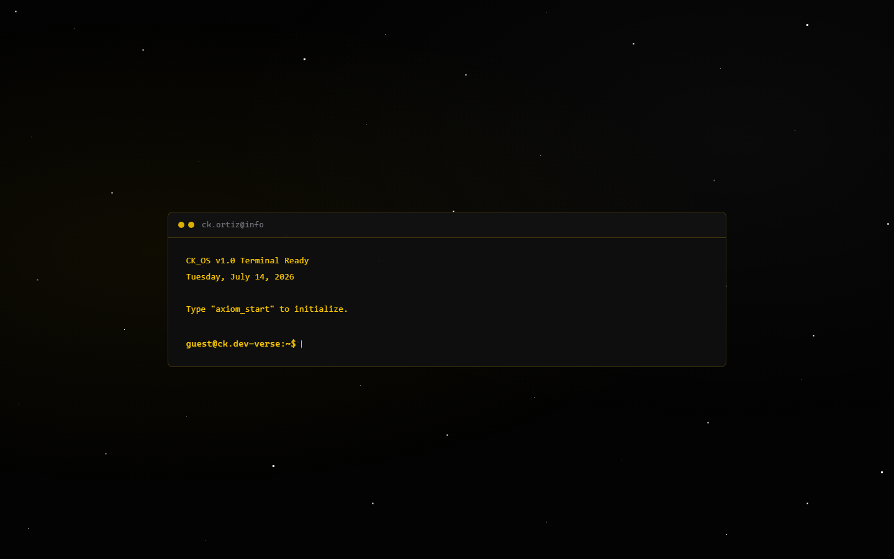

# ck.dev-verse

<p align="center">
  <strong>Terminal-style personal portfolio with a command boot sequence.</strong><br>
  Vanilla HTML, CSS, and JavaScript. No build step.
</p>

<p align="center">
  <a href="https://cikeyz.github.io/ck-dev-verse/">Live Demo</a>
  &nbsp;·&nbsp;
  <a href="#quick-start">Quick Start</a>
  &nbsp;·&nbsp;
  <a href="#project-structure">Structure</a>
  &nbsp;·&nbsp;
  <a href="#license">License</a>
</p>

<p align="center">
  
  
  
  
  
</p>

## Contents

- [Overview](#overview)
- [Features](#features)
- [Screenshots](#screenshots)
- [Quick Start](#quick-start)
- [Project Structure](#project-structure)
- [Design Notes](#design-notes)
- [License](#license)
- [Course Note](#course-note)

## Overview

ck.dev-verse presents a personal site as a terminal session. A boot overlay introduces the page, then sections cover projects, skills, work history, and contact. Styling uses amber-on-black terminal chrome without frameworks.

## Features

| Feature | Description |
|---------|-------------|
| Boot sequence | Command-line overlay before the full site |
| Section nav | About, projects, work, skills, contact |
| Terminal chrome | Amber panels, framed cards, starfield accents |
| Contact form echo | Client-side form response for demo purposes |
| Static deploy | Works from any static host or file open |

## Screenshots

| Portfolio |
|-----------|
|  |

## Quick Start

```bash
git clone https://github.com/cikeyz/ck-dev-verse.git
cd ck-dev-verse
python -m http.server 8000
# http://localhost:8000
```

## Project Structure

```text
ck-dev-verse/
├── index.html
├── script.js
├── style.css
├── LICENSE
├── README.md
├── assets/
│   ├── dewise-logo.png
│   ├── dewise-logo.svg
│   ├── dost-logo.png
│   ├── profile.jpg
│   └── pup-logo.png
└── docs/
    └── screenshots/
        └── portfolio.png
```

## Design Notes

- Dark base with amber accent (`#ffcc00`)
- Optional long-lived branch: `theme/teal-cyan` (palette experiment; not merged into `main`)

## License

MIT. See [LICENSE](LICENSE).

## Course Note

Built for CMPE 364 (Web and Mobile Systems), Polytechnic University of the Philippines, under Engr. Arlene B. Canlas. Published here as a standalone project.
